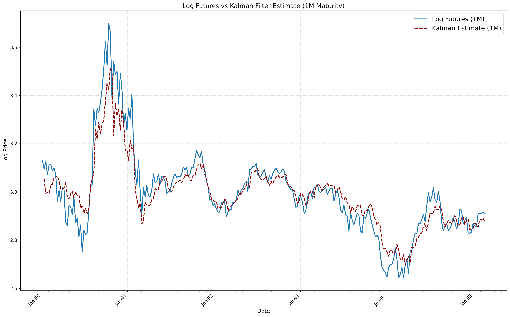

# KalmanFilter – Schwartz & Smith Two-Factor Model (WTI Crude Oil)

<p align="center">
  
  <br><em>Log WTI futures (1M) vs. Kalman-filter estimate</em>
</p>


## Project Overview
This repo implements the **Schwartz & Smith (2000) two-factor commodity model**:

`ln F(t,T) = χ_t + ξ_t + A(T−t)`

- `χ_t` – short-term, mean-reverting (Ornstein–Uhlenbeck)  
- `ξ_t` – long-term, Brownian motion with drift  
- `A(T−t) = α + β·(T−t)` – deterministic maturity term

Our 4-person quant-finance team at **emlyon business school** used a **Kalman filter** in Python to estimate these latent states for WTI crude-oil futures (1990–1995, 5 maturities).  
My contribution: **Kalman-filter implementation, state-space matrices, and likelihood optimisation.**

##  Results
| Model                | Log-Likelihood |
|----------------------|----------------|
| Two-Factor (S&S)     | **3585.8** |
| OU-only (short-run)  | 3206.3 |
| GBM-only (long-run)  | 2835.4 |

*Two-factor spec ↑ > 20 % vs. best one-factor benchmark.*

## Repository Structure
.
├── Dataset_FuturesPrices.xlsx # raw weekly WTI futures prices (Jan 1990–Jan 1995)
├── KalmanFilterImplementation.ipynb # Jupyter notebook (full analysis)
├── SchwartzSmith_ShortTermVariationsAndLongT...pdf # reference paper
└── README.md

## 🚀 Quick Start
```bash
# 1️⃣ Clone
git clone https://github.com/pVachev/KalmanFilter.git
cd KalmanFilter

# 2️⃣ Create environment
python -m venv venv
source venv/bin/activate          # Windows → venv\Scripts\activate
pip install -r requirements.txt   # see below

# 3️⃣ Run the notebook
jupyter lab KalmanFilterImplementation.ipynb
